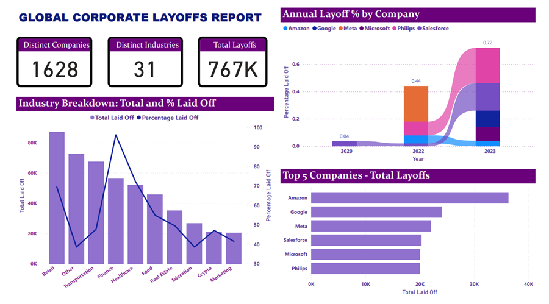
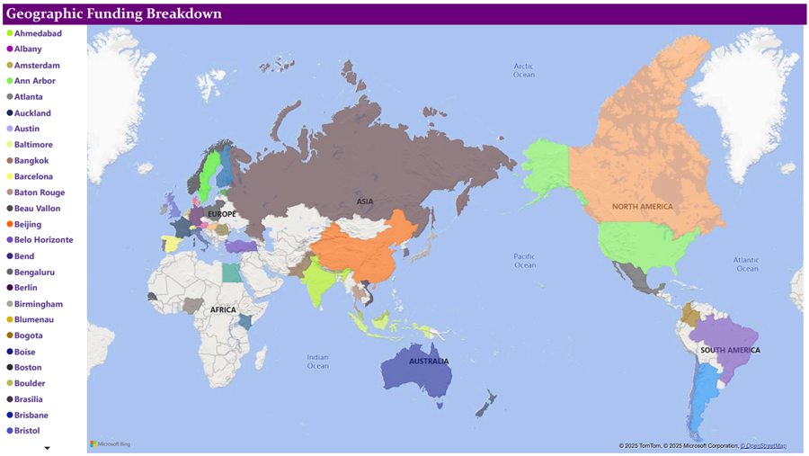
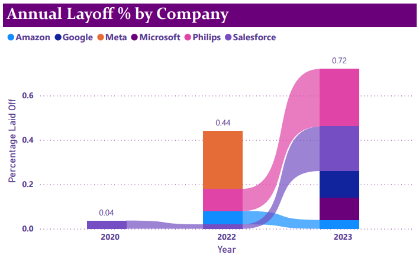
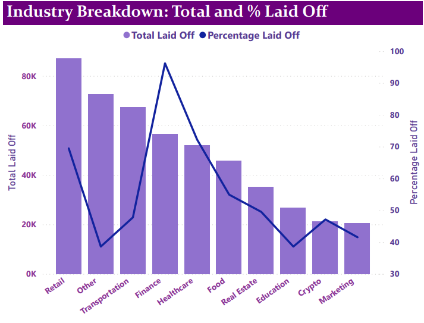
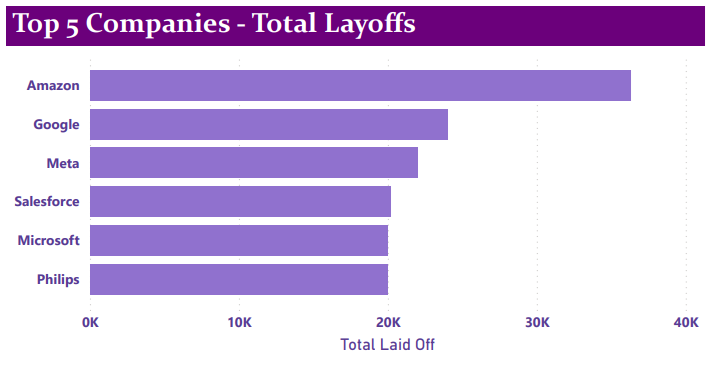

# Introduction
This project provides a comprehensive visual analysis of global corporate layoffs using data compiled from over 1,600 companies across 31 industries. The objective is to identify key trends, patterns, and impacts of workforce reductions across different sectors, geographies, and time periods.

# Tools I Used
- SQL (MySQL)
- Power BI

# Overview of Analysis:



# Data Cleaning
I used SQL for cleaning the dataset. Utilized MySQL as my database management and query editor.

### 1. Removing Duplicates

```sql
SELECT *, 
	ROW_NUMBER() OVER(PARTITION BY 
		company, 
		industry, 
		total_laid_off, 
		percentage_laid_off, 
		`date`, 
		stage, 
		country, 
		funds_raised_millions) AS row_num
FROM layoffs_staging;

WITH duplicates_cte AS (
	SELECT *, 
		ROW_NUMBER() OVER(PARTITION BY 
			company, 
			location, 
			industry, 
			total_laid_off, 
			percentage_laid_off, 
			`date`, 
			stage, 
			country, 
			funds_raised_millions) AS row_num
	FROM layoffs_staging
)
SELECT * 
FROM duplicates_cte
WHERE row_num > 1
;	

SELECT *
FROM layoffs_staging
WHERE company = 'Casper';

-- Create a new table for removing the duplicates
CREATE TABLE `layoffs_staging2` (
  `company` text,
  `location` text,
  `industry` text,
  `total_laid_off` int DEFAULT NULL,
  `percentage_laid_off` text,
  `date` text,
  `stage` text,
  `country` text,
  `funds_raised_millions` int DEFAULT NULL,
  `row_num` INT
) ENGINE=InnoDB DEFAULT CHARSET=utf8mb4 COLLATE=utf8mb4_0900_ai_ci;

SELECT *
FROM layoffs_staging2
WHERE row_num > 1;

INSERT INTO layoffs_staging2
SELECT *, 
ROW_NUMBER() OVER(PARTITION BY 
	company, 
    location, 
    industry, 
    total_laid_off, 
    percentage_laid_off, 
    `date`, 
    stage, 
    country, 
    funds_raised_millions) AS row_num
FROM layoffs_staging; 

DELETE
FROM layoffs_staging2
WHERE row_num > 1;
```

### 2. Standardizing the data

```sql
SELECT company, TRIM(company)
FROM layoffs_staging2;

UPDATE layoffs_staging2
SET company = TRIM(company);

SELECT DISTINCT industry
FROM layoffs_staging2;

SELECT *
FROM layoffs_staging2
WHERE industry LIKE 'Crypto%';

UPDATE layoffs_staging2
SET industry = 'Crypto'
WHERE industry LIKE 'Crypto%';

SELECT DISTINCT country
FROM layoffs_staging2
ORDER BY 1;

SELECT 
	DISTINCT country,
	TRIM(TRAILING '.' FROM country)
FROM layoffs_staging2
ORDER BY 1;

UPDATE layoffs_staging2
SET country = TRIM(TRAILING '.' FROM country)
WHERE country LIKE 'United States%';

SELECT `date`
FROM layoffs_staging2;

UPDATE layoffs_staging2
SET `date` = str_to_date(`date`, '%m/%d/%Y');

ALTER TABLE layoffs_staging2
MODIFY COLUMN `date` DATE;
```

### 3. Working with Nulls

```sql
SELECT *
FROM layoffs_staging2
WHERE total_laid_off IS NULL
AND percentage_laid_off IS NULL;

UPDATE layoffs_staging2
SET industry = NULL
WHERE industry = '';

SELECT *
FROM layoffs_staging2 AS t1
JOIN layoffs_staging2 AS t2
	ON t1.company = t2.company
WHERE (t1.industry IS NULL OR t1.industry = '')
AND t2.industry IS NOT NULL;

UPDATE layoffs_staging2 AS t1
JOIN layoffs_staging2 AS t2
	ON t1.company = t2.company
SET t1.industry = t2.industry
WHERE t1.industry IS NULL
AND t2.industry IS NOT NULL;

SELECT *
FROM layoffs_staging2;

SELECT *
FROM layoffs_staging2
WHERE total_laid_off IS NULL
AND percentage_laid_off IS NULL;

DELETE
FROM layoffs_staging2
WHERE total_laid_off IS NULL
AND percentage_laid_off IS NULL;

SELECT *
FROM layoffs_staging2;
```

### 4. Dropping Unnecessary Column

```sql
ALTER TABLE world_layoffs.layoffs_staging2
DROP COLUMN row_num;
```

# The Analysis
### 📆 1. Annual Layoff by Company

- **Trend (2020 → 2023):** Significant increase in percentage laid off, especially in **2022 and 2023**.

- **Highest % laid off:** **Philips**, **Salesforce**, and **Meta** in recent years.

- **Insight:** Layoffs accelerated sharply post-2021, reflecting economic downturns or restructuring across major firms.

### 🧱 2. Industry Breakdown

- **Top industries by total layoffs:** **Retail**, **Transportation**, and **Finance**.

- **Highest % laid off:** **Crypto**, **Marketing**, and **Education** sectors.

- **Insight:** While Retail had the most layoffs in volume, **Crypto and Marketing** sectors suffered proportionally higher workforce reductions.

### 📉 3. Top Companies Total Layoffs

- **Companies:** Amazon, Google, Meta, Salesforce, Microsoft, Philips.

- **Insight:** These tech giants lead in total layoffs, with **Amazon** and **Google** at the top.

- Indicates that large-scale layoffs are concentrated in major tech corporations.

### 🌍 4. Geographic Funding Breakdown

- **Locations:** Spread globally — from **Austin** and **Boston** to **Berlin**, **Bengaluru**, and **Bangkok**.

- **Insight:** Startup and company funding is geographically diverse, indicating layoffs and growth disruptions aren't limited to the U.S.